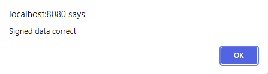
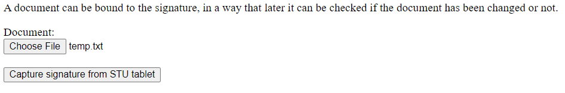

# Wacom Signature SDK for JavaScript

- [Wacom Signature SDK for JavaScript](#wacom-signature-sdk-for-javascript)
  - [Setting up the Demo application](#setting-up-the-demo-application)
    - [How to use](#how-to-use)
  - [Installation](#installation)
    - [Web Development Environment](#web-development-environment)
    - [Using the Signature SDK Sample Code](#using-the-signature-sdk-sample-code)
  - [Licensing](#licensing)
    - [Setting up the license](#setting-up-the-license)
      - [Simple demo - in demos/simple/simple.js](#simple-demo---in-demossimplesimplejs)
      - [Complete demo - in demos/complete/complete\_demo.js](#complete-demo---in-demoscompletecomplete_demojs)
      - [Wizard demo - in demos/wizard/wizard\_demo.js](#wizard-demo---in-demoswizardwizard_demojs)
    - [On premise licensing](#on-premise-licensing)
    - [Using a custom URL](#using-a-custom-url)
  - [Operate the Demo application](#operate-the-demo-application)
    - [Capture Signature](#capture-signature)
      - [Choose file](#choose-file)
      - [Capture signature from STU tablet](#capture-signature-from-stu-tablet)
      - [Capture signature from Generic device](#capture-signature-from-generic-device)
    - [Read Signature](#read-signature)
      - [Load captured signature](#load-captured-signature)
    - [Settings](#settings)
  - [Operate the Simple Demo application](#operate-the-simple-demo-application)
  - [Known issues](#known-issues)

The **Wacom Signature SDK for JavaScript** is intended to generate signature objects for the user. It provides the documentation and tools to create signature-enabled applications.
The JavaScript SDK implements the functionality in browser-ready script. No component installations are required and the SDK is platform-independent. 
It does, however, require a browser that supports **WebAssembly** primarily, and **WebHID** when using an STU tablet for pen input.

Please view the README for additional information on WebHID and WebAssembly.

## Setting up the Demo application

### How to use

Currently, WebHID works if executed locally or on a secure connection.

Download the SDK from https://developer.wacom.com/developer-dashboard

- Log in using your Wacom ID
- Select **For signature** within **Download SDKs**
- Select **More info** within **Wacom Ink SDK for signatures for JavaScript**
- Follow the instructions on the page to download the SDK

The downloaded Zip file contains the Signature SDK for JavaScript.

The Signature SDK for JavaScript is distributed as two files:

1. signature_sdk.wasm – This is the SDK itself.
2. signature_sdk.js – This is the JavaScript wrapper.

Using the SDK via the website must be done on a web server due to security restrictions. It cannot be used directly from the local file system. Additionally, the connection must be secure (https) when using another URL other than localhost.

Only the JavaScript file needs to be included & imported on the HTML page:

```
      <script src="signature_sdk.js"></script> <!-- signature SDK -->
```

Due to WebAssembly security restrictions, the demo page must be opened on a web server and not directly from a local file system.
For initial development, it is convenient to use localhost for this purpose.

## Installation

### Web Development Environment

To run the sample code first ensure you have installed the following:

* node.js e.g. download from [node.js](https://nodejs.org/en/download/)

---

### Using the Signature SDK Sample Code

* Clone the repository from GitHub.
* Follow the instructions on https://developer.wacom.com/developer-dashboard.
* Go to the demos folder. Add the `.npmrc` file created from the Developer Dashboard instructions to the demos folder. Run the following commands on the console. 
  - `npm install` -> this will download and install Signature SDK JS from Cloudsmith.
  - `npm run build` -> this will build the demo code using vite.

The web-based app needs a web server.
`npm run preview` -> this will open a web server.
  - open a web browser with the URL: http://localhost:4173


> **NB:** When making any changes to the code, including inserting a new license, it is necessary to run `npm run build` before running `npm run preview` again.  
 
### Using the Signature SDK Angular sample

To build the samples in Angular, follow the same steps above but:
- Instead of using `npm run build` to build the demo code, use `ng serve` to build the project.

## Licensing

A valid license is needed for using Signature SDK for JavaScript. 

From version 2 onwards, the SDK's license is transaction-based, and is inserted into the demo as two components:

- The license's key component
- The license's secret component

### Setting up the license

You may obtain either an evaluation license or a commercial license at: https://developer.wacom.com/en-us/developer-dashboard/license-keys. Alternatively, please contact your regional Wacom Sales representative. You can contact sales by going to https://developer.wacom.com/.

Once you have a valid license, you can initialize the Signature SDK for JavaScript by adding the license key and secret into the code. Each demo you wish to use will require the license key and secret to be added into these sections:

#### Simple demo - in demos/simple/simple.js

```javascript

	const promise = mSigObj.setLicence("key", "secret");

```

#### Complete demo - in demos/complete/complete_demo.js

```javascript

	const promise = mSigObj.setLicence("key", "secret");

```

#### Wizard demo - in demos/wizard/wizard_demo.js

```javascript

	const promise = mSigObj.setLicence("key", "secret");

```

#### Angular demo - in demos/angular_demo/src/app/app.components.ts

```typescript

	  await this.sigObj?.setLicence("key", "secret");		  

```


Now you may use any of the API functions, calling them directly from the Signature Object. You can see these functions in more detail in: Signature_SDK_JS_API.md.

### On premise licensing

The on premise feature enables hosting of the transaction license's server on local infrastructure.

**NB:** The on premise licensing features generates network traffic to Azure. 

Before the call to `setLicence()`, insert a call to the `setLicenceEndPoint(licenseEndPoint)` method of the signature object.

An example of this can be seen below:


```javascript
SigObj.setLicenceEndPoint(licenceEndPoint);
```

where `licenceEndPoint` is the URL location of the offline server.

More information about the on premise feature can be found within our [developer documentation](https://developer-docs.wacom.com/docs/sdk-for-signature/guides/javascript/on-premise/).

 ### Using a custom URL

To set a custom URL, change the `$url` within `license_proxy.php` to be the custom URL as required.

```php
...

    // Insert your URL in $url to set a custom URL for on premise licensing
    $url = "https://lms-tx.azurewebsites.net/api/Client/".$key."?hashedKey=".$sign;

...
```


## Operate the Demo application

When opening the demo application, you will reach this page. Its main functions are shown in the buttons within the screenshot below.


Each section does the following:

- Capture Signature: Choose a file to load a previously captured signature.
- Read Signature: With an attached STU, capture a new signature.
- Settings: With an attached integrated pen device, capture a new signature.

### Capture Signature

The main functionalities of this page are:

- Choose file: Choose a file to bind to the signature. This can be later used to see if the document has been changed or not.
- Capture signature from STU tablet: With an attached STU, capture a new signature.
- Capture signature from Generic device*: With an attached integrated pen device, capture a new signature.

> *These devices include, but are not limited to:
> - Wacom Pen Display Devices (DTUs and DTKs)
> - Wacom One devices
> - Wacom Cintiq devices
> - Other non-Wacom tablet devices
> 
> For a more complete list, see the [JavaScript Signature SDK section of Wacom's software compatibility with Wacom HW](https://developer-support.wacom.com/hc/en-us/articles/9354550540439-BSU-SW-Compatibility-with-Wacom-HW).


In the case of the latter two options, the user will have the option to save the signature as a .png, .txt or in Wacom's .fss (Forensic Signature Stream) format.

After using all three sections, the signature image will appear at the bottom.

The user may also add the signatory and the reason for signing in the Signatory and Reason categories. This information will appear within the signature box.

Additional data may be included through the use of "Add extra data".


#### Choose file

A file may be selected to be bound to a signature that's due to be captured.


Once the signature is generated, a document may be selected with "Choose file". From there, the user may select the "Read Signature" tab.

A list of details of the signature will be visible. Upon choosing the file previously bound to a signature, you'll get a prompt saying the signed data is correct.



If the signed data does not match, the user will be informed of this error.


#### Capture signature from STU tablet

To capture a signature with an STU, plug in an STU and click the "Capture signature from STU tablet" button.



This will then yield the prompt below.


Select the STU in the list and choose "Connect".


On the screen and STU, this display will appear.


You may now write your signature.


If you make a mistake, you may use the "Clear" button to erase all. This will remove all digital ink on the screen and revert it to how it was at the beginning.

If the user changes their mind, the "Cancel" button may be pressed at any time to close the signing application. Once happy with the signature, press OK.

The Signature will then be displayed in the Signature image box below.


#### Capture signature from Generic device

To capture a signature with an integrated pen device, plug in an integrated pen device and click the "Capture signature from Generic device" button.


On the screen, this display will appear.


You may now write your signature. This may be done by mouse, touch and pen, with a toggle list for enabling and disabling each.


If you make a mistake, you may use the "Clear" button to erase all. This will remove all digital ink on the screen and revert it to how it was at the beginning.

If the user changes their mind, the "Cancel" button may be pressed at any time to close the signing application. Once happy with the signature, press OK.

The Signature will then be displayed in the Signature image box below.

### Read Signature

#### Load captured signature

To load a previously captured signature, select a file with the "Choose File" button. This file may have been saved either as a .txt file, as an encoded bitmap or as raw FSS data.


This will then open up an instance of File Explorer and you may select a signature previously captured. This may be done through the use of a .png file.

From there, the SDK will render the signature selected by the user and display it in the "Signature image" section at the bottom of the page.


Another acceptable format for input in the SDK is a .txt file, provided the .txt file contains data for the signature stored in FSS format. An example of this format is shown below.


The FSS displayed on-screen will yield the same signature in the previous image.

From the loaded signature, the following data can be extracted such as the signatory name, reason for signing, date/time signed and additional data the user may have previously added.


### Settings

The settings section contains configuration for the demos:

- Ink: This section allows for the selection of the type of inking tool, its color and the choice of whether or not to use a background image.

- Capture window: This section allows adjustment of the capture window's size, fonts, their size and x/y offsets that appear within it and the number of buttons that appear.

- Render: This section allows configuration of the signature render upon completion of a successful signature capture.

## Operate the Simple Demo application

A simplified version of the JS demo exists within demos/simple/index.html, with the only options existing being to read a signature and capture a signature with a generic device or signature device.


## Known issues

- On Android and iOS, performing two-point touch over the signature capture area (e.g zooming in or out) will produce a defaced signature trace on the canvas.
- On a Motorola G30, the signature area is not loaded and trace is unable to be added. This is an issue with the installed web browser, rather than an issue with the Signature SDK.
- On Chrome 101 with older Windows 10 (or Windows 7) versions, it will not be possible to add STU or Generic signatures. This is a web browser issue that would, were a fix to be made, introduce further problems.
- On iOS 15, when adding strokes, occasionally a dot artifact is created at the end point of the stroke when signing. When pressing OK to complete the signature, the dot artifact is no longer visible and the signature renders correctly.
- On old Linux distributions, default Wacom drivers were pre-installed. This driver does not have support for STU devices, and once it finds a STU tablet it raises an error refusing to register the HID device. In order to allow the STU tablet to be registered as an HID device, the Wacom driver must be disabled. 
  - This can be done by putting in the file:

    `<b>/etc/modprobe.d/blacklist.conf</b>`

    on the line:

    `<b>blacklist wacom</b>`

    Then, `update-initramfs -u` to have the system re-generate the initramfs.

    On most Linux systems, USB devices are mapped with read-only permissions by default. To allow Chrome to open a USB device, you will need to add a new udev rule. Create a file at `/etc/udev/rules.d/99-stu.rules` with the following content:

   `KERNEL=="hidraw*", ATTRS{idVendor}=="056a", GROUP="plugdev", MODE="0660"` where 056a is the code for the Wacom vendor and the current user needs to be in plugdev group.

    A more generic rule could be `KERNEL=="hidraw*", ATTRS{idVendor}=="056a", MODE:="0666"` that grant permissions to all users (see udev rules manual for further details).