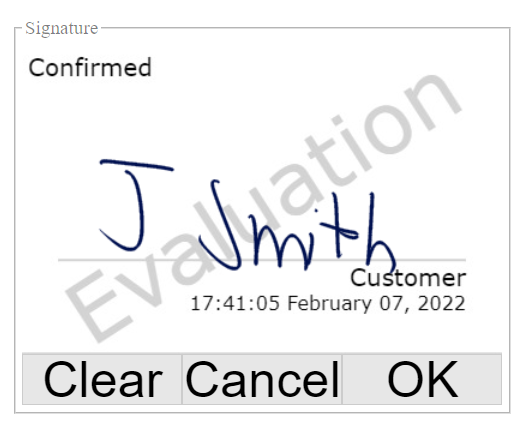

# Wacom Signature SDK for JavaScript

- [Wacom Signature SDK for JavaScript](#wacom-signature-sdk-for-javascript)
  - [Setting up the Demo application](#setting-up-the-demo-application)
    - [How to use](#how-to-use)
  - [Installation](#installation)
  - [Licensing](#licensing)
    - [Setting up the license](#setting-up-the-license)
  - [Operate the Demo application](#operate-the-demo-application)
    - [Load captured signature](#load-captured-signature)
    - [Capture with STU device](#capture-with-stu-device)
    - [Capture with Generic Pen](#capture-with-generic-pen)
  - [Known issues](#known-issues)
    - [Windows 10](#windows-10)


The **Wacom Signature SDK for JavaScript** is intended to generate signature objects for the user. It provides the documentation and tools to create signature enabled applications.
The Javascript SDK implements the functionality in browser ready script. No component installations are required and the SDK is platform independent.
It does, however, require a browser that supports **WebAssembly** primarily, and **WebHid** when using an STU tablet for pen input.

Please view the README for additional information on WebHid and WebAssembly. 

## Setting up the Demo application

### How to use

Currently, WebHid works if executed locally or on a secure connection.

The Signature SDK for JavaScript is distributed as two files:

1. wasm – This is the SDK itself.
2. js – This is the JavaScript wrapper.

Using the SDK via the website must be done on a web server due to security restrictions. It cannot be used directly from the local file system. Additionally, the connection must be secure (https) when using another URL other than localhost.

Only the JavaScript file needs to be included & imported on the html page:

```
      <script src="signature_sdk.js"></script> <!-- signature SDK -->
```

Due to WebAssembly security restrictions, the demo page must be opened on a web server and not directly from a local file system.
For initial development it is convenient to use localhost for this purpose.

For example, use node.js with http-server, then launch the demo code from the local server as:
```
  http://localhost:8080/sample/simple/index.html
```
## Installation

No SDK installation is required. Unzip the downloaded SDK files and copy them into the sample's "common" folder. 

The demonstration must be run from an http server. localhost servers are acceptable. Examples of a suitable local server include IIS, Python or Node.js. This guide will briefly go over setting up a local server in node.js. 

To summarise the node.js server setup:


- install node.js from https://nodejs.org/en/download/
- create a folder e.g. ```c:\myserver```
- start a command prompt, ```cd \myserver```
- install the server components: ```npm install http-server -g```
- start the local server: ```http-server```
- copy the SDK simple and common folders to ```\myserver```
- browse to the start page: ```http://localhost:8080/sample/simple/index.html```
- click a button for the required operation e.g. ```Capture with STU device```

For more information regarding using node.js, see: https://www.npmjs.com/package/http-server

## Licensing


### Setting up the license

 

            The Signature SDK for JavaScript requires a valid license. You may obtain either an evaluation license or commercial license at: https://developer.wacom.com/en-us/developer-dashboard/license-keys.

An evaluation license is also available here. NB: this particular license is only valid for a limited time. 

``` 
eyJhbGciOiJSUzUxMiIsInR5cCI6IkpXVCJ9.eyJpc3MiOiJiMzNhYWUyODA0NmM0MmE5OTgyY2E1NTdkZjhmY2YxOCIsImV4cCI6MTY0NTMxNTE5OSwiaWF0IjoxNjM3MjM3NTM3LCJzZWF0cyI6MSwicmlnaHRzIjpbIkpTX0NPUkUiLCJTSUdOQVRVUkVfU0RLX0FDQ0VTUyJdLCJkZXZpY2VzIjpbIldBQ09NX0FOWSIsIlJUUyJdLCJ0eXBlIjoiZXZhbCIsImxpY19uYW1lIjoiU2lnbmF0dXJlIFNESyBmb3IgSlMgZXhwcmllcyAxOSBGZWIgMjAyMiIsIndhY29tX2lkIjoiYjMzYWFlMjgwNDZjNDJhOTk4MmNhNTU3ZGY4ZmNmMTgiLCJsaWNfdWlkIjoiOTRiMDFhMmQtODJlMC00OGM3LWI5MjgtYWJiMmRkYjNiOTc3IiwiYXBwc193aW5kb3dzIjpbXSwiYXBwc19pb3MiOltdLCJhcHBzX2FuZHJvaWQiOltdLCJtYWNoaW5lX2lkcyI6W119.SiuMV-5HQP9rOeIzW_WTbRRgREN1egzqsW9c0mua2c816xRmLPhaGLjD4iDMIjBE6qIIKQFCb7uAFt522610MeaZf6yWoG4kLztSIj0FY8QQy474Yh8el4D02FsBtNHNJAPWcNuSLz9Ms55KvhYj7Gxz6SAJxAni1RmwySDbaCHYZ1y1xnn0XmCwyhR_R57xaE13lpF-5ChUXvAtooB6_koAkpB8ISWNBNojSsQv9DEf4YEp9vafcDqjumzdwH1SNqoOjo09OHXUaNAiT4xmDHVjnlm9zv9Lq61d3WlNyjbYbN_IgwnB3j-8WMXFWp0pPk7XFNPrxNb_R29b5a0SlA
``` 

Once you have a valid license, you can initialize the Signature SDK for JavaScript with the following code:

```
      try {

        mSigObj.setLicence("PUT HERE YOUR LICENCE STRING");  

      } catch (e) {

        ...

      }
```

Now you may use any of the API functions, calling them directly from the Signature Object. You can see these functions in more detail in: SIGNATURE-COMPONENTS-API.md.

Install the JWT license which is supplied separately.

To obtain a license for the SDK, please contact your regional Wacom Sales representative. You can contact sales by going to https://developer.wacom.com/.

Insert the license string in the demo code.

e.g: sample\simple\simple.js. Within this file, locate 'PUT HERE YOUR LICENCE STRING' and insert the license string in its place. 

## Operate the Demo application

When opening the demo application, you will reach this page. Its main functions are shown in the buttons within the screenshot below.


Each section does the following:

- Choose file: Choose a file to load a previously captured signature.
- Capture with STU device: With an attached STU, capture a new signature. 
- Capture with generic Pen: With an attached integrated pen device, capture a new signature. 


After using all three sections, the signature image will appear at the bottom. 

### Load captured signature

To load a previously captured signature, select a file with the "Choose File" button. This file may have been saved either as a .txt file, as an encoded bitmap or as raw FSS data.


This will then open up an instance of File Explorer and you may select a signature previously captured. This may be done through the use of a .png file.

From there, the SDK will render the signature selected by the user and display it in the "Signature image" section at the bottom of the page. 


Another acceptable format for input in the SDK is a .txt file, provided the .txt file contains data for the signature stored in FSS format. An example of this format is shown below. 


The FSS displayed on screen will yield the signature displayed in the next screenshot in the "Signature image" section at the bottom of the page. 


### Capture with STU device

To capture a signature with an STU, plug in an STU and click the "Capture with STU device" button.


This will then yield the prompt below. 


Select the STU in the list and choose "Connect".


On the screen and STU, this display will appear. 

 

You may now write your signature. 



If you make a mistake, you may use the "Clear" button to erase all. This will remove all digital ink on the screen and revert it to how it was at the beginning. 

If the user changes their mind, the "Cancel" button may be pressed at any time to close the signing application. Once happy with the signature, press OK. 

The Signature will then be displayed in the Signature image box below. 


### Capture with Generic Pen


To capture a signature with an integrated pen device, plug in an integrated pen device and click the "Capture with generic Pen" button.


On the screen, this display will appear. 


You may now write your signature. 


If you make a mistake, you may use the "Clear" button to erase all.


This will remove all digital ink on the screen and revert it to how it was at the beginning. 

If the user changes their mind, the "Cancel" button may be pressed at any time to close the signing application. Once happy with the signature, press OK. 

The Signature will then be displayed in the Signature image box below. 


## Known issues

### Windows 10

In previous versions, there was a bug on Chrome and Edge that made the SDK fail. On Windows, it could be tested using Chrome Canary, which fixed the problem. This is an issue fixed in current versions.